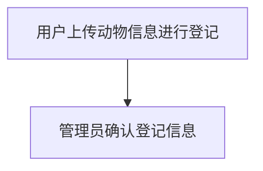
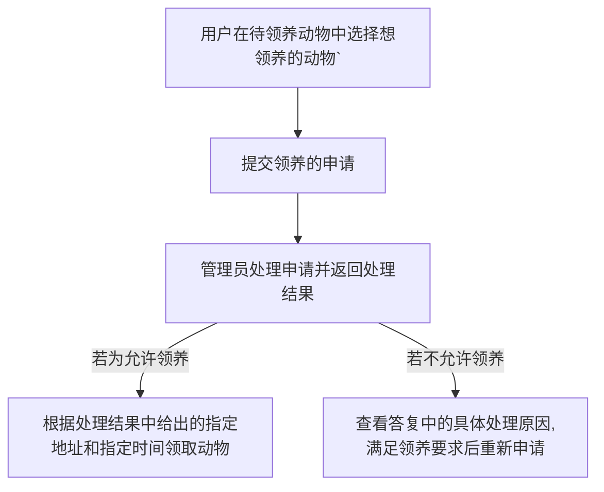
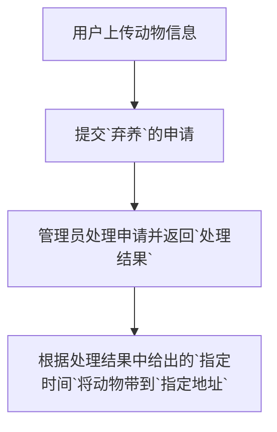
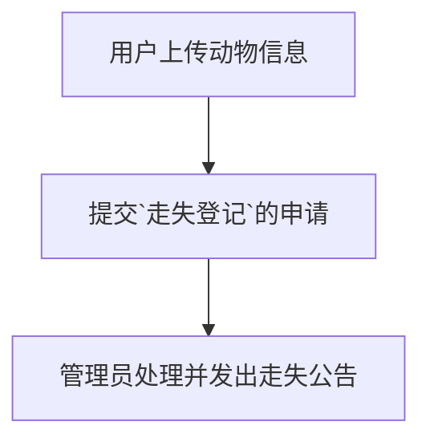
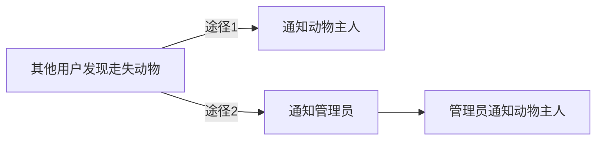

# Getting Started

### Reference Documentation
For further reference, please consider the following sections:

* [Official Apache Maven documentation](https://maven.apache.org/guides/index.html)
* [Spring Boot Maven Plugin Reference Guide](https://docs.spring.io/spring-boot/docs/2.5.6/maven-plugin/reference/html/)
* [Create an OCI image](https://docs.spring.io/spring-boot/docs/2.5.6/maven-plugin/reference/html/#build-image)
* [Spring Web](https://docs.spring.io/spring-boot/docs/2.5.6/reference/htmlsingle/#boot-features-developing-web-applications)
* [JDBC API](https://docs.spring.io/spring-boot/docs/2.5.6/reference/htmlsingle/#boot-features-sql)
* [MyBatis Framework](https://mybatis.org/spring-boot-starter/mybatis-spring-boot-autoconfigure/)

### Guides
The following guides illustrate how to use some features concretely:

* [Building a RESTful Web Service](https://spring.io/guides/gs/rest-service/)
* [Serving Web Content with Spring MVC](https://spring.io/guides/gs/serving-web-content/)
* [Building REST services with Spring](https://spring.io/guides/tutorials/bookmarks/)
* [Accessing Relational Data using JDBC with Spring](https://spring.io/guides/gs/relational-data-access/)
* [Managing Transactions](https://spring.io/guides/gs/managing-transactions/)
* [MyBatis Quick Start](https://github.com/mybatis/spring-boot-starter/wiki/Quick-Start)

# 校园流浪动物项目

## 流程

### 用户

- 注册用户

- 登录用户

- 更新用户信息

### 动物

- 动物登记
1. 用户上传`动物信息`进行登记
2. 管理员确认登记信息

- 领养动物

1. 在`待领养动物`中选择`想领养的动物`
2. 提交`领养`的申请
3. 管理员处理申请并返回`处理结果`
4. 若`允许领养`则根据处理结果中给出的`指定地址`和`指定时间`领取动物

- 弃养动物
1. 用户上传动物信息
2. 提交`弃养`的申请
3. 管理员处理申请并返回`处理结果`
4. 根据处理结果中给出的`指定时间`将动物带到`指定地址`

- 走失登记
1. 用户上传动物信息
2. 提交走失登记的申请
3. 管理员处理并发出走失公告

- 发现走失动物的处理
1. `其他用户`发现`走失动物`时通知`动物主人`
2. ...待处理

